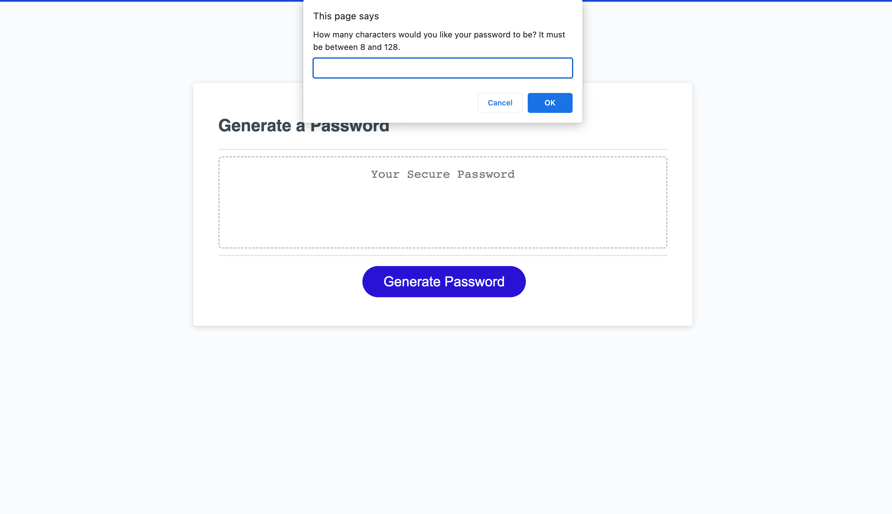
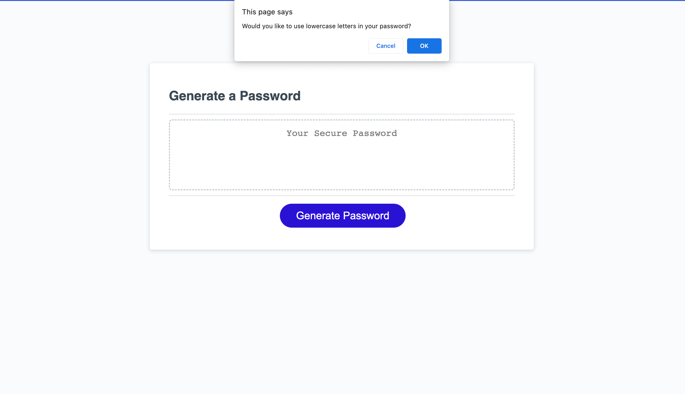
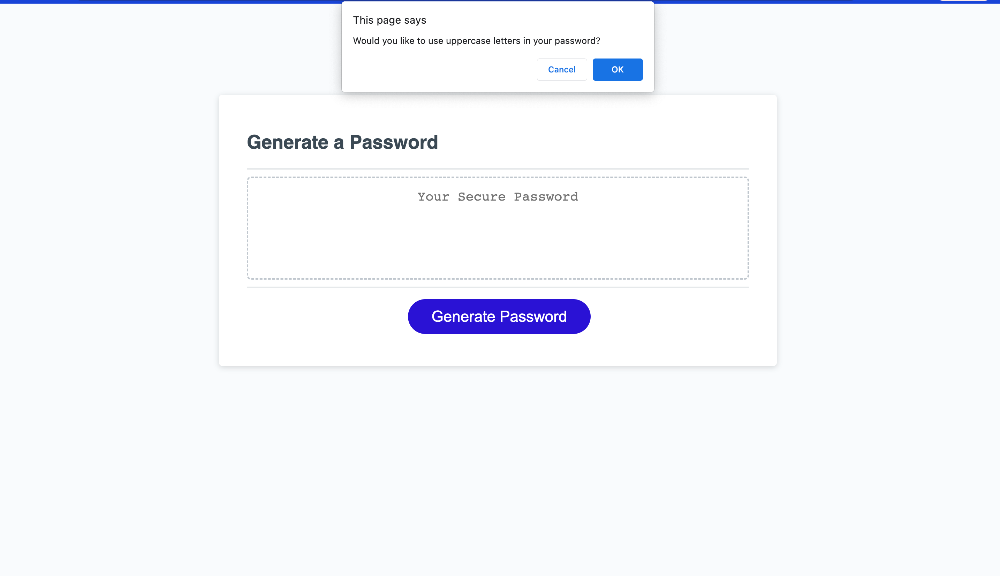
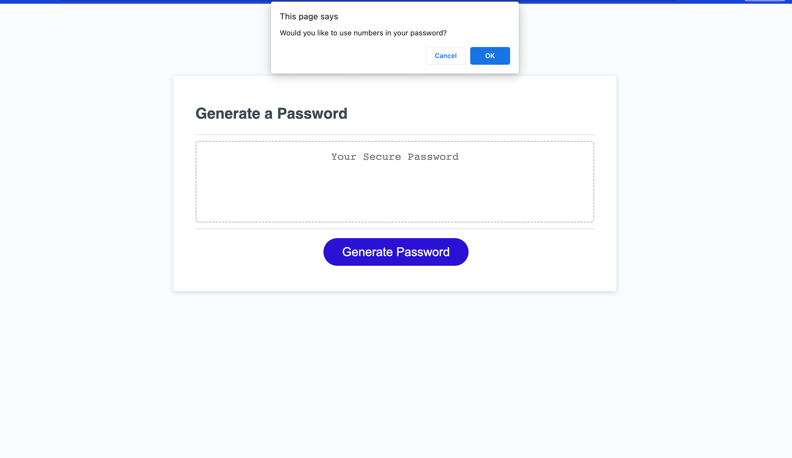
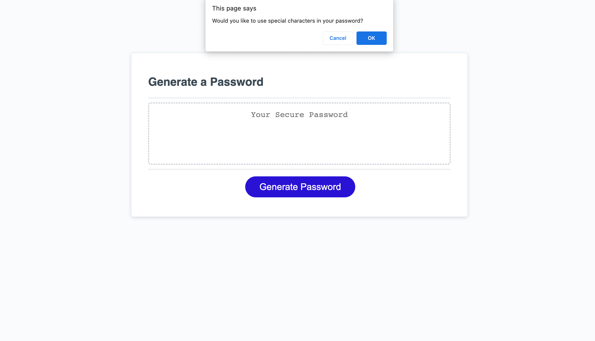
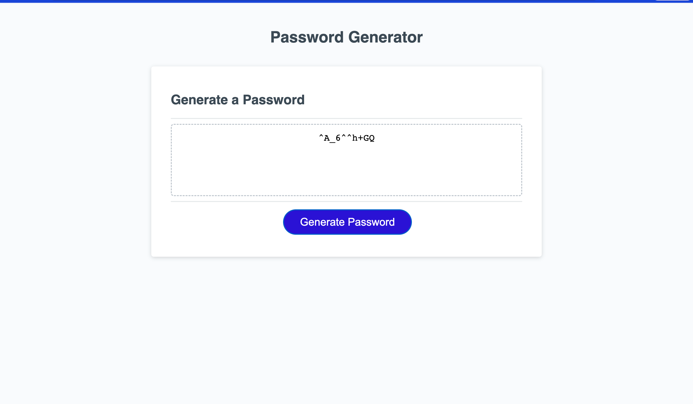

# <Password Generator>

## Description

This is a password generator that follows a number of parameters. The index.html and style.css and a few lines of the script were provided I then completed the script. This displays my knowledge of arrays, functions, prompts and a few other skills. This is a responsive website that generates passwords for its users. The user must respond to several prompts that allow them to customize the length and type of characters that are in their unique, randomly generated password.

### AS AN employer with access to sensitive data*
* I WANT to randomly generate a password that meets certain criteria
SO THAT I can create a strong password that provides greater security

## Problems Solve
This website generates a random unique password for the user, based on the specific requirements the user inputs. The acceptanec criteria that the website completes are as follows:

* GIVEN I need a new, secure password
* WHEN I click the button to generate a password
* THEN I am presented with a series of prompts for password criteria
* WHEN prompted for password criteria
* THEN I select which criteria to include in the password
* WHEN prompted for the length of the password
* THEN I choose a length of at least 8 characters and no more than 128 characters
* WHEN asked for character types to include in the password
* THEN I confirm whether or not to include lowercase, uppercase, numeric, and/or special characters
* WHEN I answer each prompt
* THEN my input should be validated and at least one character type should be selected
* WHEN all prompts are answered
* THEN a password is generated that matches the selected criteria
* WHEN the password is generated
* THEN the password is either displayed in an alert or written to the page

## Usage

The following images show the completed website. You can visit the site by clicking [here.](https://tleeming15.github.io/my-portfolio/)

 

## Installation

N/A

## License

MIT